# Unassigned Provider Transactions Data Flow

This diagram illustrates the complete workflow for detecting, analyzing, and resolving unassigned provider transactions in the dental practice management system, including both payment splits and adjustments.

```mermaid
%%--------------------------------------------------------------------------
%% UNASSIGNED PROVIDER TRANSACTIONS DATA FLOW DIAGRAM
%%--------------------------------------------------------------------------
%%{
  init: {
    'flowchart': {
      'diagramPadding': 80,
      'nodeSpacing': 65,
      'rankSpacing': 50,
      'curve': 'basis'
    },
    'themeVariables': {
      'fontSize': '16px',
      'fontFamily': 'Arial',
      'primaryColor': '#333333',
      'primaryTextColor': '#ffffff',
      'primaryBorderColor': '#000000',
      'lineColor': '#333333',
      'edgeLabelBackground': '#ffffff',
      'tertiaryColor': '#fff'
    }
  }
}%%

flowchart TB

    %%--------------------------------------------------------------------------
    %% EXTERNAL ENTITIES AND INITIAL TRANSACTION CREATION
    %%--------------------------------------------------------------------------
    User[Dental Staff]:::entityStyle -->|Create Transaction| EntryPoint["Payment/Adjustment Entry"]:::processStyle
    EntryPoint -->|Missing Provider| UnassignedTrans[(Unassigned<br>Transactions)]:::datastoreStyle
    EntryPoint -->|With Provider| AssignedTrans[(Assigned<br>Transactions)]:::datastoreStyle

    %%--------------------------------------------------------------------------
    %% SYSTEM A: DETECTION & MONITORING
    %%--------------------------------------------------------------------------
    subgraph DetectionSystem["System A: Detection & Monitoring"]
        WeeklySchedule[Weekly Schedule]:::entityStyle -->|Trigger| RunQuery["Run Unassigned<br>Provider Query"]:::processStyle
        UnassignedTrans -->|Paysplit Data| RunQuery
        AdjStore[(Adjustment<br>Records)]:::datastoreStyle -->|Adjustment Data| RunQuery
        
        RunQuery -->|Raw Results| DataPrep["Format & Prioritize<br>Transactions"]:::processStyle
        DataPrep -->|Prioritized List| ResultsStore[(Unassigned Provider<br>Report)]:::datastoreStyle
        
        ResultsStore -->|Trend Analysis| TrendAnalysis["Monitor Patterns<br>& Volume"]:::processStyle
        TrendAnalysis -->|Threshold Alert| Notification["Generate<br>Notifications"]:::processStyle
        Notification -->|Alert| ReportDistribution["Distribute Report"]:::processStyle
    end

    %%--------------------------------------------------------------------------
    %% SYSTEM B: ANALYSIS & PROVIDER SUGGESTION
    %%--------------------------------------------------------------------------
    subgraph AnalysisSystem["System B: Analysis & Provider Suggestion"]
        ResultsStore -->|Transaction Data| PatientLookup["Patient Account<br>Lookup"]:::processStyle
        PatientLookup -->|Patient History| PatientStore[(Patient<br>Records)]:::datastoreStyle
        
        PatientStore -->|Appointment History| ApptAnalysis["Analyze Appointment<br>History"]:::processStyle
        ApptStore[(Appointment<br>Records)]:::datastoreStyle -->|Provider Info| ApptAnalysis
        
        ApptAnalysis -->|Recent Provider| ProvSuggestion["Generate Provider<br>Suggestions"]:::processStyle
        ProcedureStore[(Procedure<br>Records)]:::datastoreStyle -->|Related Procedures| ProvSuggestion
        
        ProviderStore[(Provider<br>Records)]:::datastoreStyle -->|Provider Data| ProvSuggestion
        ProvSuggestion -->|Suggested Provider| EnhancedReport[(Enhanced Unassigned<br>Provider Report)]:::datastoreStyle
        
        %% Priority determination
        ResultsStore -->|Amount & Age| PriorityCalc["Calculate<br>Priority Level"]:::processStyle
        PriorityCalc -->|Priority Assignment| EnhancedReport
    end

    %%--------------------------------------------------------------------------
    %% SYSTEM C: RESOLUTION WORKFLOW
    %%--------------------------------------------------------------------------
    subgraph ResolutionSystem["System C: Resolution Workflow"]
        EnhancedReport -->|Assignment Tasks| TaskAssignment["Assign Resolution<br>Tasks"]:::processStyle
        TaskAssignment -->|Staff Assignment| StaffQueue[(Staff Task<br>Queue)]:::datastoreStyle
        
        StaffQueue -->|Task Details| ProviderSelection["Select Correct<br>Provider"]:::processStyle
        ProviderSelection -->|Provider Choice| TransferApproval["Review & Approve<br>Transfer"]:::processStyle
        
        %% Transfer process
        TransferApproval -->|Approved| ExecuteTransfer["Execute Provider<br>Transfer"]:::processStyle
        ExecuteTransfer -->|Update Record| UpdateTransaction["Update Transaction<br>Record"]:::processStyle
        
        %% Recording & auditing
        UpdateTransaction -->|Transaction Update| UnassignedTrans
        UpdateTransaction -->|Resolution| ResolutionLog[(Transfer<br>Resolution Log)]:::datastoreStyle
        
        %% Feedback loop
        ResolutionLog -->|Statistics| PerformanceMetrics["Calculate Resolution<br>Metrics"]:::processStyle
        PerformanceMetrics -->|Metrics| TrendAnalysis
    end

    %%--------------------------------------------------------------------------
    %% SYSTEM D: PREVENTION & PROCESS IMPROVEMENT
    %%--------------------------------------------------------------------------
    subgraph PreventionSystem["System D: Prevention & Process Improvement"]
        ResolutionLog -->|Root Cause Data| RootCauseAnalysis["Analyze Root<br>Causes"]:::processStyle
        RootCauseAnalysis -->|Training Needs| TrainingDevelopment["Develop Training<br>Materials"]:::processStyle
        TrainingDevelopment -->|Training Program| StaffTraining["Conduct Staff<br>Training"]:::processStyle
        
        RootCauseAnalysis -->|System Issues| SystemImprovement["Identify System<br>Improvements"]:::processStyle
        SystemImprovement -->|Configuration Changes| SystemUpdate["Update System<br>Configuration"]:::processStyle
        
        %% Policy updates
        RootCauseAnalysis -->|Process Gaps| PolicyUpdate["Update Income<br>Transfer Policy"]:::processStyle
        PolicyUpdate -->|New Procedures| DocumentationUpdate["Update Workflow<br>Documentation"]:::processStyle
        
        %% Prevention feedback
        StaffTraining -->|Trained Staff| User
        SystemUpdate -->|Improved System| EntryPoint
        DocumentationUpdate -->|Updated Procedures| User
    end

    %%--------------------------------------------------------------------------
    %% CONNECTIONS BETWEEN SYSTEMS
    %%--------------------------------------------------------------------------
    ReportDistribution -->|Distributed Report| TaskAssignment
    
    %%--------------------------------------------------------------------------
    %% LEGEND
    %%--------------------------------------------------------------------------
    subgraph Legend["Legend"]
        direction LR
        Process["Process"]:::processStyle
        DataStore[(Data Store)]:::datastoreStyle
        Entity[External Entity]:::entityStyle
        SystemA[Detection & Monitoring]:::detectionStyle
        SystemB[Analysis & Suggestion]:::analysisStyle
        SystemC[Resolution Workflow]:::resolutionStyle
        SystemD[Prevention]:::preventionStyle
    end

    %%--------------------------------------------------------------------------
    %% CLASS DEFINITIONS
    %%--------------------------------------------------------------------------
    classDef entityStyle stroke:#333,stroke-width:2px,fill:#fff,color:#000
    classDef datastoreStyle stroke:#333,stroke-width:2px,fill:#fff,color:#000,shape:cylinder
    classDef processStyle stroke:#333,stroke-width:2px,fill:#fff,color:#000,rx:10,ry:10

    classDef detectionStyle fill:#ffcccc,stroke:#333,stroke-width:2px
    classDef analysisStyle fill:#cce5ff,stroke:#333,stroke-width:2px
    classDef resolutionStyle fill:#fff2cc,stroke:#333,stroke-width:2px
    classDef preventionStyle fill:#e6ccff,stroke:#333,stroke-width:2px

    class DetectionSystem detectionStyle
    class AnalysisSystem analysisStyle
    class ResolutionSystem resolutionStyle
    class PreventionSystem preventionStyle

    %% Add new style for critical paths
    classDef criticalPath stroke:#ff0000,stroke-width:3px
    class ProviderSelection,ExecuteTransfer criticalPath
```

## Diagram Description

The diagram maps the complete workflow for unassigned provider transactions through four main systems:

### System A: Detection & Monitoring
- Identifies unassigned provider transactions through scheduled queries
- Prioritizes transactions based on amount and age
- Generates alerts and reports for staff attention

### System B: Analysis & Provider Suggestion
- Analyzes patient records to suggest appropriate providers
- Checks appointment history, procedures, and provider data
- Assigns priority based on transaction characteristics

### System C: Resolution Workflow
- Manages the task assignment and provider selection process
- Tracks the execution of provider transfers
- Records resolution for performance tracking

### System D: Prevention & Process Improvement
- Analyzes root causes of unassigned transactions
- Updates training, system configuration, and policies
- Creates feedback loops to reduce future occurrences

This diagram complements the main system data flow by providing detailed focus on the specific workflow for managing unassigned provider transactions, which require special handling to ensure proper revenue attribution. 