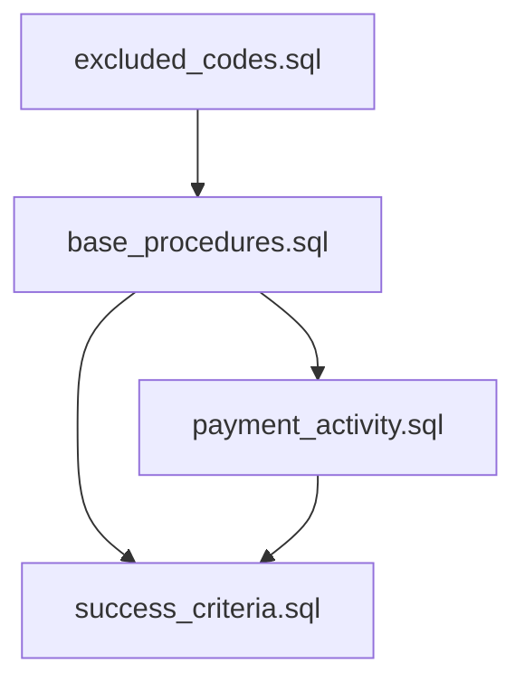

# Procedure Log CTEs Documentation

## Overview
This document provides detailed documentation for Common Table Expressions (CTEs) used in procedure log validation queries. Each CTE is documented with its purpose, dependencies, and usage patterns.

## Core CTEs

### excluded_codes.sql
**Purpose**: Defines procedure codes that should be excluded from certain analyses
- Identifies non-billable procedures
- Filters out administrative codes
- Handles special case procedures

**Dependencies**: None

**Usage**:
- Used by `base_procedures.sql`
- Applied in financial analyses
- Referenced in procedure bundling logic

### base_procedures.sql
**Purpose**: Creates the foundational procedure dataset with essential fields and filters
- Applies standard exclusions
- Adds derived fields
- Establishes core procedure attributes

**Dependencies**:
- excluded_codes.sql

**Key Fields Added**:
- Procedure categorization
- Date validations
- Status classifications

### payment_activity.sql
**Purpose**: Aggregates payment information for procedures
- Combines insurance and direct payments
- Calculates payment ratios
- Tracks payment timing

**Dependencies**:
- base_procedures.sql

**Key Metrics**:
- Total payments
- Payment sources
- Payment timing

### success_criteria.sql
**Purpose**: Defines and calculates procedure success metrics
- Payment completion
- Timeline adherence
- Clinical outcomes

**Dependencies**:
- base_procedures.sql
- payment_activity.sql

## Usage Guidelines

### Performance Considerations
- CTEs are designed to be composable
- Some CTEs may be computationally intensive
- Consider materialization for large datasets

### Common Join Patterns
```sql
-- Example of typical CTE usage chain
WITH 
excluded_codes AS (...),
base_procedures AS (...),
payment_activity AS (...)
```

### Extension Points
- Adding new procedure categories
- Modifying success criteria
- Expanding payment logic

## CTE Dependency Graph


## Validation Rules

### Data Quality Rules
- Date validity checks
- Status consistency
- Payment logic validation

### Business Logic Rules
- Procedure categorization
- Success criteria definitions
- Payment completion requirements

## Notes
- CTEs are designed to be reusable across different queries
- Each CTE focuses on a specific aspect of procedure validation
- Dependencies are managed to minimize redundant calculations

## Future Improvements
- [ ] Add performance metrics for each CTE
- [ ] Document common optimization patterns
- [ ] Add example use cases
- [ ] Create test cases for validation rules 